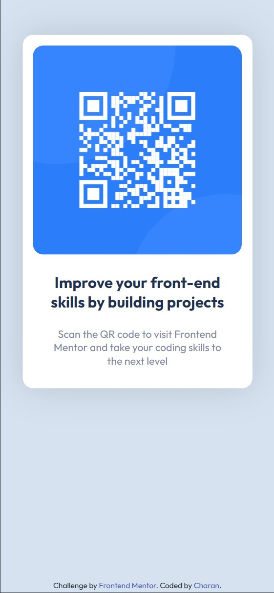

# Frontend Mentor - QR code component solution

This is a solution to the [QR code component challenge on Frontend Mentor](https://www.frontendmentor.io/challenges/qr-code-component-iux_sIO_H). Frontend Mentor challenges help you improve your coding skills by building realistic projects. 

## Table of contents

- [Frontend Mentor - QR code component solution](#frontend-mentor---qr-code-component-solution)
  - [Table of contents](#table-of-contents)
  - [Overview](#overview)
    - [Screenshot](#screenshot)
    - [Links](#links)
  - [My process](#my-process)
    - [Built with](#built-with)
    - [What I learned](#what-i-learned)
  - [Author](#author)

## Overview

Here's my solution to the Frontend Mentor's - QR code component challenge.

### Screenshot

**Desktop Version** 

**Mobile Version** 

### Links

- Solution URL: [https://github.com/CharanMN7/QR-code-component](https://github.com/CharanMN7/QR-code-component)
- Live Site URL: [https://charanmn7.github.io/QR-code-component/](https://charanmn7.github.io/QR-code-component/)

## My process

I started off setting up the fonts. For this, instead of importing it from the provided URL, I used the `@font-face` property to use the provided fonts in my solution. Just wanted to flex my CSS muscle a little bit 😅.
After that, I wrote the HTML to set up the layout. Later I wrote the CSS. It was easy, nothing more than centering some containers and coloring elements. And! put some `box-shadows` too.
Lastly, adjusted the attribution part, a little, to put it at the bottom of the page.

### Built with

- Basic HTML & CSS
- Custom font imported using the `@font-face` CSS property.

### What I learned
This challenge gave me a clarity about what I should be spending my time on while working on a frontend project like this. Start with laying the foundations and do not worry about what might happen to the design already. Always stick to the step-by-step approach. First the layout (HTML) and later, the styling (CSS).

## Author

- Website - [Charan Manikanta](https://bio.link/charanmanikanta)
- Frontend Mentor - [@CharanMN7](https://www.frontendmentor.io/profile/CharanMN7)
- Twitter - [@CharanMN7](https://www.twitter.com/CharanMN7)
